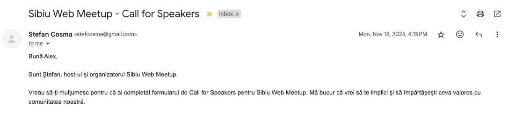
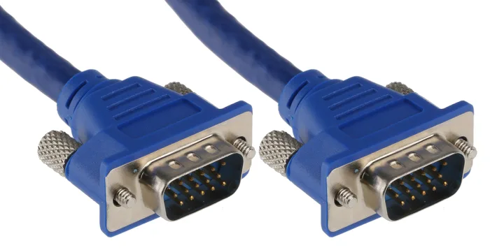
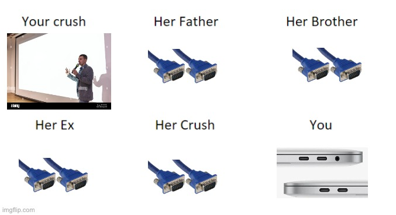
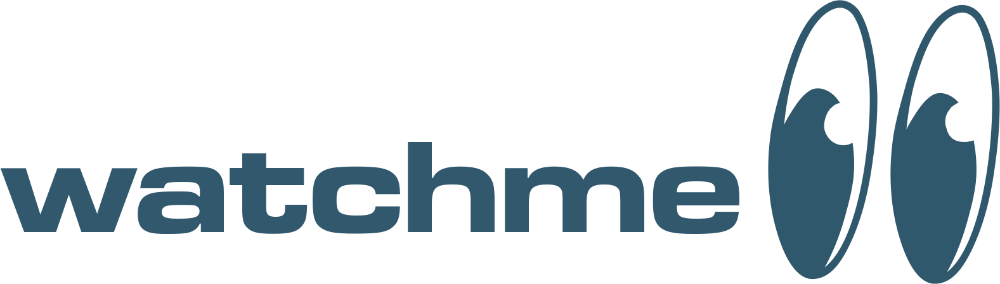
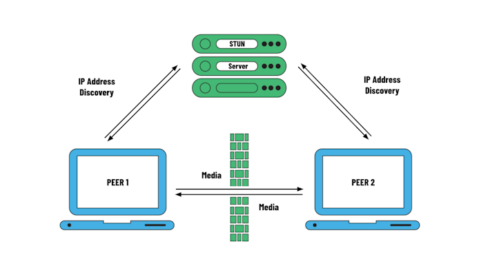
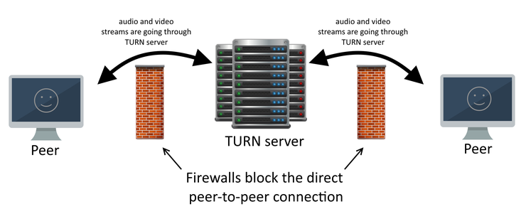
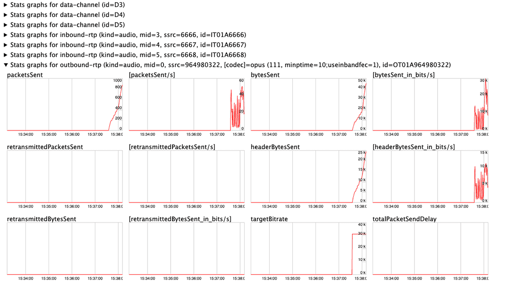
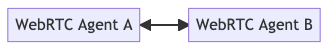
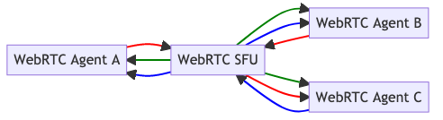
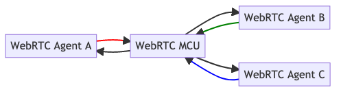

# WebRTC
<h2>start <span class="blinking">:</span> here</h2>

A gentle introduction to the real-time communication standard of the web

<div style="position: absolute; left: 0; bottom: 0; margin-left: 10px;">
  <span>Sibiu Web Meetup</span>
</div>

<div style="position: absolute; bottom: 0; left: 50%; transform: translateX(-50%)">
  <span>January 2025</span>
</div>

<div class="abs-br m-0 text-xl">
  <span>axbg</span>
  <a href="https://github.com/axbg" target="_blank" class="slidev-icon-btn">
    <carbon:logo-github />
  </a>
</div>

<style>
.blinking {
  animation: blink 2s infinite;
}

@keyframes blink {
  0% { opacity: 1; }
  50% { opacity: 0; }
  100% { opacity: 1; }
}
</style>

---
title: Personal Intro
layout: image-right
image: ./assets/headshot.jpeg
---

# hello, I'm @axbg

<br><br><br><br>

- 👨🏻‍💻 Software Engineering Specialist @ Accenture
- 🧑🏻‍💼 Technical Trainer @ Devmind
- 🧑🏻‍🏫 Teaching Assistant @ CSIE ASE

<br><br><br><br>
<br><br>

Find my open-source projects on GitHub: @axbg
<br>
Check my articles: [encapsulated.axbg.cloud](https://encapsulated.axbg.cloud)

---
title: Talk Intro 1
layout: default
---
# Why did this talk happen?

<br><br>

<div v-click style="display: flex; justify-content: center">
  
</div>

---
title: Talk Intro 2
layout: default
---
# Why did this talk happen?

<div style="display: flex; justify-content: center">
  
</div>

---
title: WebRTC? How come?
layout: image-right
image: ./assets/presentation.avif
---
# WebRTC? How come?
<br><br>

<v-clicks>

- Teaching stuff is cool, but you have to talk a lot
- Talking is (often) boring (for the listener)
- You have to **present** something for the audience to, **hopefully**, get less bored
- So, most of the time, you will use a **projector** to share some kind of **content**

</v-clicks>

---
title: yes, but
---
# yes, but

### what do you do if you encounter something like this in 2025?

<div v-click style="display: flex; justify-content: center">
  
</div>

---
title: yes, but 2
---

<br>
<div v-click style="display: flex; justify-content: center;">
  
</div>
---
title: How to solve this problem?
layout: center
---
# How to solve this problem?

<v-clicks>

- the most reasonable solution: buy an adapter
- the next most reasonable solution: use Zoom
- my (not so reasonable) solution: **build an app**

</v-clicks>

---
title: dream app
layout: image-right
image: ./assets/code.avif
---
# my dream app
<br>

The plan is to build an application that I can use to share my screen seamlessly

The application should be:

<v-clicks>

- easy to build
- easy to deploy 
- working on various clients
- adaptable to all network conditions

</v-clicks>

---
title: watchme demo
layout: two-cols
---
# watchme
web native real-time media share

available [here](https://git@github.com:devclub1/watchme)

built on:
- TypeScript
- React
- Express
- Socket.IO (WebSockets)
- **WebRTC**

::right::
<div style="height: 100%; display: flex; justify-content: center; align-items: center;">
  
</div>
---
title: What is WebRTC?
layout: image-right
image: ./assets/webrtc-logo.png
---
# what is WebRTC?

<br>

- a free and open-source project that became a web standard
- a collection of technologies used together to achieve performant real-time peer-to-peer (P2P) transmissions using UDP
- a global standardization effort
- a pragmatic approach that makes use of preexisting protocols
- a secure-by-default way to exchange real-time media
- a set of APIs that can be used to integrate real-time media exchange in web applications
---
title: WebRTC for the Curious
layout: image-right
image: ./assets/webrtc-cover.png
---
# WebRTC for the Curious

<br><br>

- an open-source book created by WebRTC implementers
- available for free forever at [webrtcforthecurious.com](https://webrtcforthecurious.com/)
- the main source of information for this talk
- (yes, I had the same look when I managed to implement my first WebRTC demo)

---
title: Underlying technologies
---
# WebRTC: underlying technologies

<div style="display: flex; justify-content: center">
  
</div>
<!--
SCTP: Stream Control Transmission Protocol
DTLS: Datagram Transport Layer Security
SRTP: Secure Real-time Transport Protocol
RTCP: Real Time Control Protocol
RTP: Real Time Protocol
-->
---
title: Components & processes
---
# Components & processes
<br>

<v-clicks>

The underlying technologies, which represent the fabric of WebRTC, are used in a specific order to exchange real-time media between two clients

For a connection to be established, each of these processes must succeed:

- Signaling
  - Media negotiation
  - Discovery
- Establishing connection

Let's take a closer look at each of them

</v-clicks>
---
title: Signaling 1
layout: image-right
image: ./assets/hands.jpg
---
# Signaling
finding each other

<v-clicks>

WebRTC aims to establish a P2P connection between two participants (we'll call them **peers**)

As in all P2P systems, before the connection can be established, a mechanism that allows the peers to find each other is required

Funny enough, even though it's the first step, **WebRTC does not cover signaling**: each implementer can choose how the peers will discover each other

The most common approach is to use a *WebSocket* server that governs the initial discovery process

</v-clicks>

---
title: Signaling 2
---
# Signaling
exchanging data about data

<v-clicks>

Signaling starts with an exchange between the peers:
- one of them will initiate the process by sending an **offer**
- after reviewing the offer the other one responds with an **answer**

These objects, which are exchanged through the signaling server, contain all the information required for the peers to understand **what type of media will be streamed**

No connection is established at the moment, but if the negotiation between the peers does not succeed, the process is dropped

The *offer* and the *answer* are part of the *Session Description Protocol* (SDP) which is used internally by WebRTC

</v-clicks>
---
title: Signaling 3
---
# Signaling
a direct path

<v-clicks>

The peers know what media will be exchanged, but they are not connected yet

Besides the initial process, where a centralized "meeting" point is used, WebRTC aims to use P2P connections 

The main advantages are:
- Lower latency
- Lower infrastructure costs
- Increased security (as data is not processed by any central server)

The advantages come with some caveats, as establishing a direct connection between two peers in a huge network like the Internet is not a trivial task

</v-clicks> 

---
title: Signaling 4
layout: two-cols
---
# Signaling
real-world networking issues

<v-clicks>

Unlike the more common client/server systems, where the server is directly accessible on the Internet, peers in P2P connections might not share the same network or have public IP addresses

In such cases, Network Address Translation (NAT) is the key mechanism that enables connections

NAT mapping allows devices on a private network to communicate with other devices on the Internet by translating their private IP addresses into a public IP address

NAT also makes it possible for external devices to connect to agents in a private network using an existing mapping

</v-clicks>

::right::
<div style="display: flex; height: 80%;justify-content: center">
  
</div>
---
title: NATs
---
# The world is NATs

<v-clicks>

NATs come in different flavors, and sometimes they can block peers from establishing a connection

The most important classification describes the mapping creation behaviors, where NATs can be:
  - Endpoint independent - once a mapping is created it can be reused
  - Address/Address and Port dependent mapping - a mapping is created for each connection, targeting a specific address or address and port

The same classification can be applied to mapping filtering behaviors

**For WebRTC to work using P2P, at least one of the peers should have an endpoint-independent mapping**

In case P2P connection is not possible, WebRTC can still function using a relay server

</v-clicks> 

---
title: Signaling 
layout: two-cols
---
# Signaling
who am I? (a pragmatic question)

<v-clicks>

The details about the NAT are not known to the peers

While they can create NAT mappings by sending outbound requests, they are not aware of their own Internet-facing address

This is where the Session Traversel Utilities for NAT **(STUN)** protocol comes into play

To learn more about their external IP, each peer will connect to a STUN server and will receive information about the external IP mapping done by NAT

</v-clicks> 

::right::
<div style="display: flex; justify-content: center; align-items: center; height: 100%;">
  
</div>

---
title: Establishing connection
---
# Establishing connection
ICE ICE baby

<v-clicks> 

To establish a connection, WebRTC uses the Interactive Connectivity Establishment (ICE) technology

ICE uses the STUN answer, together with the local IP of the peer, to determine a list of possible addresses that can be used for connection

The candidates are exchanged using the signaling server and ICE starts to group each local candidate with each remote candidate, obtaining multiple *candidate pairs*

ICE tries to establish a connection between the members of each pair, and, based on connectivity and performance, selects a pair that becomes the *selected candidate pair* that will be used for the rest of the session

The peers are now P2P connected, and they can start to exchange media respecting the *offers* that they agreed upon

<div style="display: flex; justify-content: center;">
  <i style="font-size: 5rem">🔗</i>
</div>

</v-clicks>

---
title: Establishing connection 2
layout: two-cols
---
# Establishing connection
rely on relaying

<v-clicks>

If a direct connection cannot be established due to the restrictive nature of the NATs, a direct ICE connection will fail as well

In this situation, ICE will use the **Traversal Using Relays around NAT (TURN)** protocol to mediate the exchange through a **relay server**

Unlike the STUN server, which does not establish a permanent connection with the peers, the TURN server will receive traffic from each peer and will ensure the correct retransmission

**A robust WebRTC integration should always use TURN as a fallback mechanism**

</v-clicks>

::right::
<div style="display: flex; justify-content: center; align-items: center; height: 100%;">
  
</div>

---
title: enough talk, show me the code
layout: center
---
# enough talk, show me some code
visiting the main browser WebRTC APIs
---
title: Capturing user media
---
# Capturing user media
<br>

<v-clicks>

Before exchanging media streams, a client should *capture* them

Most browsers support the standard *Media Capture and Streams API* (MediaStream API) which allows the capture of webcams, screens, device audio, and microphones

```js {none|1-2|3-4|all}
// captures webcam and microphone
const capturedUserStream = await navigator.mediaDevices.getUserMedia({ video: true, audio: true});
// captures screen and audio device (currently supported only in Chrome for individual browser tabs)
const captureMediaStream = await navigator.mediaDevices.getDisplayMedia({ video: true, audio: true });
```

The user will be prompted for consent for each captured stream

The MediaStream API was developed together with the WebRTC API, so the captured media streams can seamlessly be used as sources in the live media exchange process

Each track can receive as a parameter an object representing the [*constraints*](https://developer.mozilla.org/en-US/docs/Web/API/MediaTrackConstraints) that should be applied

</v-clicks>

---
title: something
---
# Preparing connection
peers and stream

<v-clicks>

Then, the initiating client is ready to create a peer instance:
```js {none|1-4|5|all}
// the configuration object is used to configure the ICE process
// in a simple implementation, it just specifies which STUN/TURN servers to use
//  in more complex implementations, the configuration object can define additional options: https://developer.mozilla.org/en-US/docs/Web/API/RTCPeerConnection/RTCPeerConnection
const configuration = {'iceServers': [{'urls': ['stun:stun.l.google.com:19302', 'turn:TURN_IP:3478[user:password]']}]}
const peerConnection = new RTCPeerConnection(configuration);
```

Before creating an offer, the peer instance should be instructed how to handle upcoming connections

The order in which these configurations are written is not important, as they will be triggered after the offer is sent

First thing could be to bind the captured user media stream to the peer instance:
```js {none|all}
capturedUserMedia.getTracks().forEach(track => {
  // the type of each added track can be determined by the 'kind' property (e.g: video, audio)
  // if the tracks are associated with a stream instance, WebRTC will handle them together
  peerConnection.addTrack(track, capturedUserMedia);
});
```

</v-clicks>

---
title: Preparing connection
---
# Preparing connection
handling events

<v-clicks>

Each WebRTC interaction is handled in an event-like manner: each peer will do an action, while the other will specify ahead of time its behavior for each event

So, the peer should be instructed what to do when it receives tracks from the remote peer:
```js {none|all}
peerConnection.ontrack = (event) => {
  // even though individual tracks are received, we are referencing to the stream
  // this way, both video and audio tracks could be handled by the same HTML video element
  videoElement.srcObject = event.streams[0];
};
```

When the offer is created, WebRTC will start gathering ICE candidates and will send each one of them to the connecting peer through the signaling server:
```js {none|all}
peerConnection.onicecandidate = (event) => {
  if (event.candidate) {
    // generic method that will rely on the signaling server
    sendToSignalingServer(event.candidate)
  }
};
```

</v-clicks>
---
title: Preparing connection 2
---
# Preparing connection
give me an offer

<v-clicks>

Peers are informed each time the state of the connection changes:
```js {none|1,2|3,5,7,9|all}
peerConnection.onconnectionstatechange = () => {
  switch (peerConnection.connectionState) {
    case "connected":
      //...
    case "disconnected":
      //...
    case "closed":
      //...
    case "failed":
      //...
}};
```

Now the initiating peer is ready to create an offer and send it to the other peer through the signaling server:
```js {none|1|2-5|7|all}
const offer = await peerConnection.createOffer();
await peerConnection.setLocalDescription(offer);

sendToSignalingServer(offer);
```

</v-clicks>
---
title: Accepting an offer
---
# Accepting an offer
<br>

<v-clicks>

When an offer is received, the receiver creates its own peer instance following a very similar set of steps, accepts the offer and sends the answer back:
```js {none|1|2-6|8|10-11|13|all}
webSocket.on("receiving-offer", async (payload) => {
  const peerConnection = new RTCPeerConnection(configurations);

  // ...
  // setting up its event handlers
  // ...

  peerConnection.setRemoteDescription(payload.offer);

  const answer = await peerConnection.createAnswer();
  await peerConnection.setLocalDescription(answer);

  sendToSignalingServer(answer);
});
```

</v-clicks>

---
title: Breaking the ICE
---
# Breaking the ICE
the perfect candidate

<v-clicks>

The only thing that was not covered in the until now is handling remote ICE candidates

Besides gathering and sending its own ICE candidates to the signaling server, each peer should prepare to receive the ICE candidates of the opposite side:

```js {none|1|2-4|all}
webSocket.on("ice-candidate", (payload) => {
  peerConnection.addIceCandidate(new RTCIceCandidate(payload.candidate))
    .then(() => console.log("Added ICE candidate from viewer", payload.candidate))
    .catch(error => console.error("Error adding ICE candidate:", error));
});
```

Starting with the first candidate that arrives, WebRTC creates and tests all the possible **pairs**

Once the best pair is found, the connection state is promoted to **connected** and the negotiated streams are exchanged P2P

<div v-click style="display: flex; justify-content: center">
  <p style="font-size: 5rem">🎆</p>
</div>

</v-clicks>

---
title: Renegotiation
---
# Renegotiation
signing new contracts

<v-clicks>

It happens frequently for the peers to want to remove some media tracks or add new ones after the connection is established

For soft removal, a solution is to disable, keeping the option to enable it again later:

```js {none|1|2|all}
if (captureUserMedia && capturedUserMedia.getVideoTracks().length > 0) {
  capturedUserMedia.getVideoTracks()[0].enabled = false;
}
```

Adding or removing tracks trigger the renegotiation process which should establish a new pair of offer and answer:

```js {none|1|2-5|all}
peerConnection.onnegotiationneeded = () => {
  const offer = await peerConnection.createOffer();
  // make sure to reuse the existing peer on both ends
  await peerConnection.setLocalDescription(offer);
  sendToSignalingServer(offer);
}
// modify the media tracks associated with the peerConnection to trigger the renegotiation
```

By default, the ICE connection will not be modified, but a peer can request it by toggling the **iceRestart** parameter

</v-clicks>

---
title: Renegotiation 2
---
# Renegotiation
beware the glare

<v-clicks>

On the receiving end, the peer should also be reused: 

```js {none|1|2-5|8|all}
webSocket.on("receiving-offer", async (payload) => {
  if (peerConnection) {
    peerConnection.setRemoteDescription(payload.offer);

    const answer = await peerConnection.createAnswer();
    await peerConnection.setLocalDescription(answer);

    sendToSignalingServer(answer);
  } else {
    peerConnection = new RTCPeerConnection(configurations);
    // the rest of the configuration discussed above
  }
}
```

Renegotiation can be triggered by both ends, and when both ends emit an offer at the same time, the ICE state machine could be upset

This is known as the **glare problem** and there are [ways to handle it beautifully](https://blog.mozilla.org/webrtc/perfect-negotiation-in-webrtc/)

</v-clicks>

---
title: Watching data flow
---
# Watching data flow
and debugging it

<v-clicks>

Most browsers offer similar interfaces for viewing and debugging active and recently closed WebRTC connections

- For Chromium-based browsers: **chrome://webrtc-internals/**
- For Firefox: **about:webrtc**

<div style="display: flex; justify-content: center;">
  
</div>
</v-clicks>

---
title: Useful resources
---
# Useful resources

- The book: https://webrtcforthecurious.com/
- Mozilla's WebRTC API documentation: https://developer.mozilla.org/en-US/docs/Web/API/WebRTC_API
- Find out your NAT type: https://www.checkmynat.com/
- Public STUN servers: https://gist.github.com/mondain/b0ec1cf5f60ae726202e
- How to set up a TURN server using coturn: https://gabrieltanner.org/blog/turn-server/
- coturn configuration example: https://gist.github.com/axbg/c947f838387998d81664036a7beb3c27
- Find your ICE candidates: https://webrtc.github.io/samples/src/content/peerconnection/trickle-ice/
- Slidev: for cool, code-based presentations: https://sli.dev/
---
title: Facetime, but with way less features
---
# Facetime, but with (way) less features
demo time

<v-clicks>

To showcase the concepts described during the session, I built an app *(another one)*

A *couple* of users can join a live session where they can share both their webcam and microphone

A user will start a room and will receive a randomly generated ID that should be used by the other users to join the same room

The app is built using:
- React
- Express
- Socket.io (WebSocket)
- **WebRTC**

(if you think that's because I reused a lot of code from *watchme* that's because it's true)

</v-clicks>
---
title: the problem in the room
layout: center
---
# the *problem* in the room

<div style="display: flex; justify-content: center;">
<i style="font-size: 3rem">🐘</i>
</div>
---
title: P2P downside
---
# P2P downside
(a big one)

<v-clicks>

P2P has a lot of benefits, but one important downside: it does not scale well

The previous example could handle a small group of people, but after a dozen, the number of parallel connections becomes unmanageable

Each user must handle n-1 connections, and the total number of connections can be computed as n * (n - 1) / 2

This is the reason why, to build robust real-time media applications, P2P is often not enough

To solve this issue, in addition to pure P2P topologies *(see below)*, WebRTC supports client/server topologies
<br><br>
<div style="display: flex">
  <div>
    
    <span>One-to-one</span>
  </div>
    <div>
    
    <span>Full Mesh</span>
  </div>
    <div>
    
    <span>Hybrid Mesh</span>
  </div>
</div>

</v-clicks>

---
title: Client/Server topologies
---
# Client/Server topologies

<v-clicks>

- Selective Forward Unit (SFU) 
<div style="display: flex">
  
</div>

- Multi-point Conferencing Unit (MCU 🦸‍♂️)
<div style="display: flex">
  
</div>

</v-clicks>

---
title: DataChannels
---
# One more thing
and more data

<v-clicks>

Although WebRTC is well known for media transmission, it can also be used to transmit raw data using a **DataChannel**

A DataChannel can handle any data, and can be used to transmit raw media when specialized decoding methods are needed

Each peer can handle 65534 DataChannels, and they can be opened and closed at any time, as negotiation is not needed

The other steps of the connection process are the same

```js {none|1|3|5|7-9|11|all}
const peerConnection = new RTCPeerConnection(configurations);

// establish connection

const dataChannel = pc.createDataChannel("channel1");

dataChannel.onMessage = (message) => { }
dataChannel.onopen = () => { }
dataChannel.onclose = () => { }

dataChannel.send("hello there");
```

</v-clicks>

---
title: that's it
layout: center
---
# that's it!
WebRTC in a not-so-short-nor-exhaustive intro
---
title: Image sources
---
# Pictures

- Intro: [Getty Images](https://unsplash.com/photos/colorful-bright-image-of-female-hand-holding-old-fashioned-green-colored-phone-picking-up-handset-isolated-over-orange-background-concept-of-pop-art-vintage-things-mix-old-and-modernity-2Oj9tGznf5k)
- Slide 5: [Teemu Paanen](https://unsplash.com/photos/person-discussing-while-standing-in-front-of-a-large-screen-in-front-of-people-inside-dim-lighted-room-bzdhc5b3Bxs)
- Slide 9: [Pankaj Patel](https://unsplash.com/photos/turned-on-monitor-displaying-programming-language-u2Ru4QBXA5Q)
- Slide 13: [WebRTC for the Curious](https://webrtcforthecurious.com/docs/01-what-why-and-how/)
- Slide 15: [Freepik](https://www.freepik.com/free-photo/hands-gently-touching-each-other_2111016.htm#fromView=keyword&page=1&position=2&uuid=b92cd659-cd23-48d4-b100-24975b99aab0&query=Touching+Hands)
- Slide 18: [WebRTC for the Curious](https://webrtcforthecurious.com/docs/03-connecting/)
- Slide 22: [Medialooks](https://support.medialooks.com/hc/en-us/articles/360000225451-TURN-server-deployment-and-usage)
- Slide 32: [WebRTC For Developers](https://www.webrtc-developers.com/debugging-webrtc-in-the-browsers/)
- Slide 36: [WebRTC for the Curious](https://webrtcforthecurious.com/docs/08-applied-webrtc/)
- Slide 37: [WebRTC for the Curious](https://webrtcforthecurious.com/docs/08-applied-webrtc/)

---
title: Q&A
layout: center
---
# thank you for being here

<div style="color: #2c7a7b; position: absolute; left: 50%; transform: translate(-50%, 0);">
  <h2>Q&A</h2>
</div>

<div style="color: #2c7a7b; position: absolute; left: 0; bottom: 0; margin-left: 10px;">
  <span>Sibiu Web Meetup</span>
</div>

<div style="color: #2c7a7b; position: absolute; bottom: 0; left: 50%; transform: translateX(-50%)">
  <span>January 2025</span>
</div>

<div class="abs-br m-0 text-xl" style="color: #2c7a7b">
  <span>axbg</span>
  <a href="https://github.com/axbg" target="_blank" class="slidev-icon-btn">
    <carbon:logo-github />
  </a>
</div>
